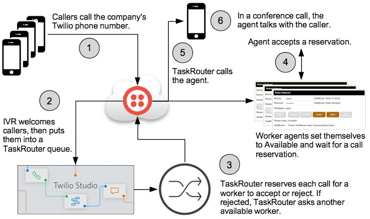
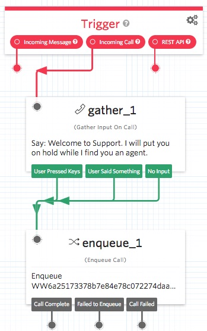
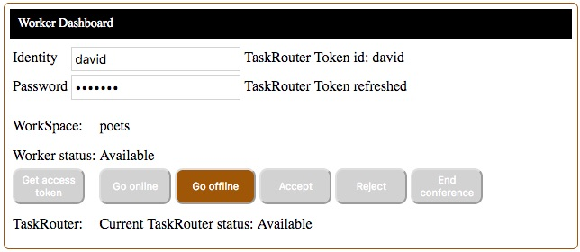
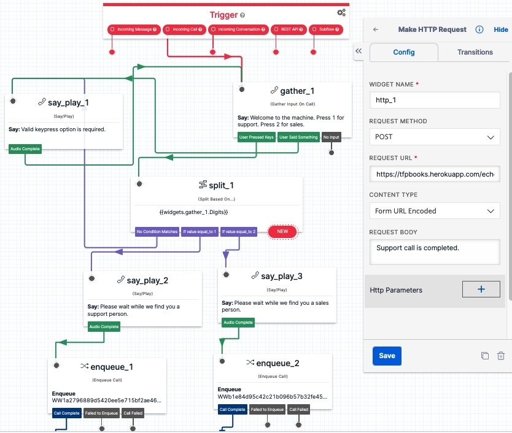
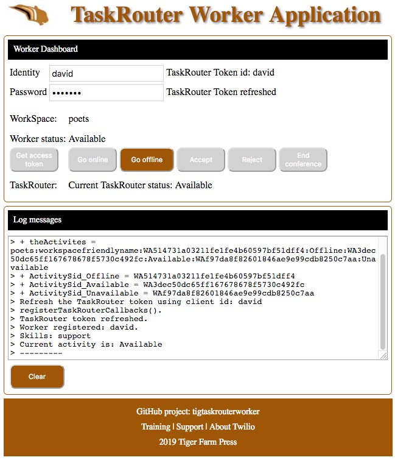

# Implement a Call Workflow Application

In less than two hours, you can use Twilio Studio and TaskRouter to implement a call flow application system.
This is the bases of a caller-agent application.

When someone calls your Twilio phone number, they'll hear an IVR welcome message
and get added into a workflow task queue.
They'll hear music wait while they wait for TaskRouter to find them an agent.
TaskRouter will prompt an agent with the option to Accept the call task.
If the agent rejects the task, TaskRouter will ask the next available agent.
If they Accept the call task, they are connected with the caller.

#### Call Work Flow



--------------------------------------------------------------------------------
## Implementing the Call Work Flow System

Steps to configure a TaskRouter workspace,
setup a Studio IVR flow with a Twilio phone number,
implement and test the TaskRouter Worker website application:
1. [Configure](README.md#configure-your-taskrouter-workspace) your Twilio TaskRouter Workspace.
2. [Create](README.md#create-an-ivr-studio-flow-to-manage-incoming-calls) an Studio IVR to welcome the caller and put them into the TaskRouter workflow queue.
3. [Configure](README.md#configure-your-twilio-phone-number-to-use-the-studio-ivr-flow) your Twilio phone number to use the Studio IVR.
4. [Implementation](README.md#local-computer-implementation) on your local computer.
5. [Test](README.md#test-the-application) the call work flow application system.

Click [here](https://www.youtube.com/watch?v=OElX06i40Mg) for a video of me walking through the steps.
Note, the application in the video is an older PHP app, however it works basically the same as this NodeJS application.

#### Implementation requirements:
- You will need a [Twilio account](http://twilio.com/console). A free Trial account will work for testing.
- For testing, you will need at least 2 phone numbers: 
one to be the caller, and the other for the worker (agent).

These are the setup instructions which are located on this 
[tfptaskrouter](https://github.com/tigerfarm/tfptaskrouter/blob/master/README.md) GitHub repository.

--------------------------------------------------------------------------------

### Configure your TaskRouter Workspace

A task begins with a caller being added into a workspace's workflow.
The workflow puts the caller into a task queue which is a voice queue.
The workflow finds a worker to take the call that is in the queue.

A worker can set their activity availablity status.
A worker has attributes to match them to one or more task queues.

Go to the [TaskRouter dashboard](https://www.twilio.com/console/taskrouter/dashboard):

Create a Workspace, and set:
- Name: writers.

Create a Task Queue for callers, and set:
- Task Queue Name to: Support.
- Set "Reservation Activity" and "Assignment Activity" to Offline.
- Max Reserved Workers: 1.
- Queue expression: skills HAS "support".
- Note, workers that have support call skills: "skills":["support"], will be asked to take calls in this queue.

Create a Workflow, and set:
- Friendly Name: Support.
- Assignment Callback, Task Reservation Timeout: 10. This gives the worker 10 seconds to accept the reservation before TaskRouter sets them to unavailable, and asks another worker to accept the call reservation. Note, this value can be overridden in the web application.
- Default queue: Support.

Create a Worker, and set:
- Worker name: dave.
- Attributes to: {"name":"dave","skills":["support"],"contact_uri":"+16505551111"}.
- Replace 16505551111, with your mobile phone number. This is the number that TaskRouter will use to call you, the worker.
- Attribute "name", is used [retrieve a worker's SID](https://www.twilio.com/docs/taskrouter/api/worker?code-sample=code-list-workers-with-target-expression&code-language=Node.js&code-sdk-version=4.x).
Attribute "name" value needs to match the "Worker name" value.

View your Worker Activities options:
- Offline, cannot be assigned a task
- Available(online) to be assign a task
- Unavailable, the worker is working on a task

--------------------------------------------------------------------------------

### Create an IVR Studio Flow to Manage Incoming Calls

The Studio flow will welcome the caller and then put them into the TaskRouter support workflow.

Go to the Studio dashboard:
https://www.twilio.com/console/studio

Create a new flow, and set:
- Friendly name: Writers IVR.
- Use the default: Start from scratch.

Drag a "Gather Input On Call" widget onto the flow panel, to welcome callers.
- Join Trigger Incoming Call to the Gather widget.
- Set the Text to Say to: "Welcome to Support. I will put you on hold while I find you an agent."
- Set "Stop gathering after" to 1 digit to allow the caller to quickly put themself into the queue.

Drag an "Enqueue Call" widget onto the flow panel, to put callers into the TaskRouter support workflow.
The workflow will put the caller into the support task queue.
- Join the Gather widget to the Enqueue Call widget.
- Set, TaskRouter Workspace, to: writers.
- Set, TaskRouter Workflow, to: support.



Click Save. Click Publish. The Studio flow is complete and ready to use.

### Configure your Twilio phone number to use the Studio IVR Flow

In the Twilio Console, if you don't already have a Twilio phone number,
[buy a phone number](https://www.twilio.com/console/phone-numbers/search).

In the phone number’s configuration page,
- Set Voice & Fax, A Call Comes In, to: Studio Flow / Writers IVR
- Click Save.

Test, by using your mobile phone to call your IVR Twilio phone number.
- You will hear the Gather widget welcome message.
- You will be put into the TaskRouter queue(a voice queue) and hear the wait music.
Check that the queue has 1 caller (currentSize:1):
````
$ node voiceQueueList.js
++ Get voice queue list.
+  DateCreated:Sep 23 2020  SID:QU362afc106606164d74151aa4750a3160 currentSize:1    maxSize:100 friendlyName:WW1a2796889d5420ee5e715bf2ae460a99 averageWaitTime:106
````
Note, the friendlyName is the workflow SID.
- Disconnect/hangup the call. Your IVR is successfully tested.

--------------------------------------------------------------------------------

### Local Computer Implementation

The application has a NodeJS HTTP webserver which makes Twilio TaskRouter REST API requests.
Click [here](https://www.twilio.com/docs/taskrouter/api) for the TaskRouter API documentation.

Download the [tfptaskrouter repository](https://github.com/tigerfarm/tfptaskrouter) zip file.

1. Click Clone or Download. Click Download ZIP.
2. Unzip the file into a work directory.
3. Change into the unzipped directory.

Install the NodeJS modules.
````
$ npm install twilio
$ npm install request
````
List of "require" modules used: twilio, request, express, path, and url.

Environement variables:
- TR_ACCOUNT_SID : your Twilio account SID (starts with "AC", available from Twilio Console)
- TR_AUTH_TOKEN : your Twilio account auth token (available from Twilio Console, click view)
- TR_TOKEN_PASSWORD : application password that is used by a worker to receive an access tokens.
- WORKSPACE_SID : your TaskRouter workspace SID

Run the NodeJS HTTP server.
````
$ node webserver.js 
+++ TaskRouter application web server is starting up.
+ ACCOUNT_SID   :ACakm3g5o8s9i6egrpakogpserkasglqe3:
+ WORKSPACE_SID :WS365319d72750ec7fc9bc8e5007c993ec:
+ Listening on port: 8000
+ Workspace friendlyName: writers
...
````
Note, CTRL + c to shutdown the webserver.

Use a browser to access the application: http://localhost:8000/index.html

--------------------------------------------------------------------------------

### Test the Application

TaskRouter workers will use their web browser to manage their status: 
"offline" or "online" available to accept tasks.

Go to the TaskRouter worker website application
[link](http://localhost:8000/index.html).

In your browser, go to your TaskRouter Workers Application.
- WorkSpace name is displayed: writers.
- Enter your worker name: dave.
- Enter your token password.
- Click Get access token. Worker status is displayed: Offline.
- Click Go online. Worker status is displayed: Available.
- Click Go offline, and Go online, which is how you set your availability status.
- Click Go online,to be available for a call reservation.



When the worker first connects to the application, 
the workspace activity options are listed in the Log messages:
````
...
> + ActivitySid_Offline = WA31703104b45cd069126e71c5de67a869
> + ActivitySid_Available = WA87258175ab8843ec6d75e54274eb456c
> + ActivitySid_Unavailable = WAd869170e0a0d27f9846c070b0edcaf79

I enter my identity: dave, and the application password.
Click Get access token.
Logs:
> Refresh the TaskRouter token using client id: dave
> TaskRouter Worker token refreshed, stringlength :3088:
> registerTaskRouterCallbacks().
> TaskRouter token refreshed.
> Worker registered: dave.
> Skills: support
> Current activity is: Offline

I have a TaskRouter worker token.
Click Go online.
I check worker status and see that I'm (dave) Available(online).
$ node workerStatus.js
+++ Start.
++ List worker activity status.
+ WK1ab6ad88a07a856306c88ccaab3aa56a : edith : Offline
+ WKb9302b30213ee6a76c10cf8b4cf94612 : dave : Available
````

From the voice caller's side:
````
I make a voice call to my TaskRouter Twilio phone number.
The call is answered by the Studio flow IVR.

The Studio IVR Gather widget says a welcome messages,
then I'm put on hold in a TaskRouter workflow queue:
$ node voiceQueueList.js
++ Get voice queue list.
+  DateCreated:Sep 23 2020  SID:QU362afc106606164d74151aa4750a3160 currentSize:1    maxSize:100 friendlyName:WW1a2796889d5420ee5e715bf2ae460a99 averageWaitTime:18

A task is created:
$ node tasksList.js
+++ List tasks.
++ SID: WT4d990906295fe68dc399bf37b2cbfe5b assignmentStatus: pending, Queue:support
````

Interactions:
````
---------
Dave's status is: Available(oneline)
Dave is offered the option to Accept or Reject the task.
The workflow has a Task Reservation Timeout of 10 seconds. 
Dave does not click one of the option within the timeout, the reservation times out:
> reservation.created: You are reserved to handle a call from: +16505551111
> Reservation SID: WRdbd876a888b28be2bde65f95d4c93019
> reservation.task.sid: WT4d990906295fe68dc399bf37b2cbfe5b
> Worker activity updated to: Offline
> taskSid = WT4d990906295fe68dc399bf37b2cbfe5b
> Reservation timed out: WRdbd876a888b28be2bde65f95d4c93019

Dave is automatically set to offline,
Task status: pending
Reservation status:timeout.
$ node tasksReservationsList.js
+++ List tasks and their reservations(if any).
++ SID: WT4d990906295fe68dc399bf37b2cbfe5b assignmentStatus: pending, Queue:support
++ SID: WT4d990906295fe68dc399bf37b2cbfe5b assignmentStatus: pending Task Queue:support Reservation sid:WRdbd876a888b28be2bde65f95d4c93019 status:timeout workerName:dave

---------
Dave goes back online and clicks Accept.
> reservation.created: You are reserved to handle a call from: +16505551111
> Reservation SID: WR73d497bfe50fdee8c68477763121e564
> reservation.task.sid: WT4d990906295fe68dc399bf37b2cbfe5b

Dave is called by TaskRouter, but doesn't answer.
> Reservation canceled: WR5289882026894a2d7a037d8e5c32ceaa
> Worker activity updated to: Offline
> Reservation timed out: WR73d497bfe50fdee8c68477763121e564
The reservation is cancelled.
$ node tasksReservationsList.js
...
++ SID: WT4d990906295fe68dc399bf37b2cbfe5b assignmentStatus: pending Task Queue:support Reservation sid:WR5289882026894a2d7a037d8e5c32ceaa status:canceled workerName:dave

---------
Dave goes back online and clicks Accept.
When called, Dave answers the phone.
> Conference SID: CFbe1c7137e028b6ed411fdd2aa12fbecb
> Worker activity updated to: Unavailable
> taskSid = WT4d990906295fe68dc399bf37b2cbfe5b

Task status: accepted.
The task attributes contain the conference call information.
$ node tasksReservationsList.js
+++ List tasks and their reservations(if any).
++ SID: WT4d990906295fe68dc399bf37b2cbfe5b assignmentStatus: assigned, Queue:support
+++ theAttributes from:+16505551111 conference.sid:CFbe1c7137e028b6ed411fdd2aa12fbecb worker:CA681c3a7bfc94c1b4823fc3f2e4eb99f6 customer:CA002d535f41152c11893f284398cfdb14
....
++ SID: WT4d990906295fe68dc399bf37b2cbfe5b assignmentStatus: assigned Task Queue:support Reservation sid:WR39728a4f4b1883993472d3983a48dc10 status:accepted workerName:dave

Dave's worker status is unavailable because he is on a call.
$ node workerStatus.js
+++ Start.
++ List worker activity status.
+ WK1ab6ad88a07a856306c88ccaab3aa56a : edith : Offline
+ WKb9302b30213ee6a76c10cf8b4cf94612 : dave : Unavailable

The task voice queue is empty because the caller is now in a conference call.
$ node voiceQueueList.js
++ Get voice queue list.
+  DateCreated:Sep 23 2020  SID:QU362afc106606164d74151aa4750a3160 currentSize:0    maxSize:100 friendlyName:WW1a2796889d5420ee5e715bf2ae460a99 averageWaitTime:0

Conference call status: in-progress.
Note, the friendlyName is the task SID: WT4d990906295fe68dc399bf37b2cbfe5b.
$ node conferenceList.js
+++ List conference calls.
+  SID: CFbe1c7137e028b6ed411fdd2aa12fbecb status: in-progress friendlyName: WT4d990906295fe68dc399bf37b2cbfe5b

---------
Dave clicks End conference, and Dave and the caller are disconnected.
$ node conferenceList.js
+++ List conference calls.
+  SID: CFbe1c7137e028b6ed411fdd2aa12fbecb status: completed friendlyName: WT4d990906295fe68dc399bf37b2cbfe5b

Dave is status: offline.
Note, the task goes from accepted to wrapping.
Then a program process sets the task from accepted to wrapping.
Then the web appplication sets the task from wrapping to completed.
Dave's status becomes offline.
$ node workerStatus.js
...
+ WKb9302b30213ee6a76c10cf8b4cf94612 : dave : Offline
````

You now have a working and tested TaskRouter implementation.

--------------------------------------------------------------------------------
# Add another Worker, Workflow, and Task Queue

Create a Worker, and set:
- Worker name: dave.
- Attributes to: {"name":"susan","skills":["sales"],"contact_uri":"+16505553333"}.

Create a Task Queue for callers, and set:
- Task Queue Name to: Sales.
- Max Reserved Workers: 1.
- Queue expression: skills HAS "sales".

Create a Workflow, and set:
- Friendly Name: Sales.
- Set "Reservation Activity" and "Assignment Activity" to Offline.
- Assignment Callback, Task Reservation Timeout: 10.
- Default queue: Sales.

Modify the Studio flow for both Sales and Support:
- Modify the Gather "Text to Say" message: Welcome to the machine. Press 1 for support. Press 2 for sales.
- Add a TaskRouter writers/Sales Enqueue Call widget.
- Add a Split widget below the Gather widget.
- Set Split "Variable to test" to widgets.gather_1.Digits.
- Set Split transitions to the support and sales Enqueue Call widget.



Click Save. Click Publish. The Studio flow is complete and ready to use.

Test by calling the Studio flow Twilio phone number.
- Press 1 and confirm support option continues to work.
- Press 2 and confirm that the new sales option works.

--------------------------------------------------------------------------------
#### Have a Twilio Function Monitor TaskRouter Events


--------------------------------------------------------------------------------
#### Next steps:
- TaskRouter task to voicemail: [Implementing Voicemail with Twilio Flex, TaskRouter, and Insights](https://help.twilio.com/articles/360021082934)
- Add business hours to your IVR: [Time of day routing with Functions](https://www.twilio.com/docs/runtime/quickstart/time-of-day-routing#time-of-day-routing-in-a-studio-flow)
- Implement a Twilio Client so that agents can receive calls on their laptop. Click [here](https://github.com/tigerfarm/OwlClient) for my sample Twilio Client which has more features such as putting callers on hold.

--------------------------------------------------------------------------------

### Documentation Notes for Developers

webserver.js : Node.js web server program for testing this application on a local host.

#### Utility Programs

conferenceList.js : List conferences.

tasksList.php : List task information.

tasksReservationList.php : List tasks and their reservations(if any).

workerStatus.js : Node.js program to list the status of all the WorkSpace workers.

#### Dev Utility Programs

conferenceSetCompleted.js : Set a conference call's status to: completed.

generateWorkerToken.js : Generate a TaskRouter Worker access token.

taskReservationList.js : List a task's information.

taskSetWrapToCompleted.js : If task status is "wrapping", changed to: "completed".

taskDeleteAll.js : List and delete all tasks.

tasksReservationWrapSetCompleted.js : List task information and, if the status is wrapping, change it to completed.

workspaceActivites.js : List a WorkSpace's Activities.

--------------------------------------------------------------------------------

### TaskRouter Worker Application Version 4.0

Functionality:
- Using their browser, the application allows workers to enter their identity and a password.
- Workers manage their status: available(online) or unavailable(offline) to take a call.
- Workers can accept or reject a task.
- If a worker's reservation times out, the worker status is changed to unavailable.
- A worker can end a conference call which disconnects all participants.
- If a task is set to wrapping after the conference call has ended,
the task is automatically reset to completed. This allows the worker to take another call task.

Application screen print:



--------------------------------------------------------------------------------

Cheers...