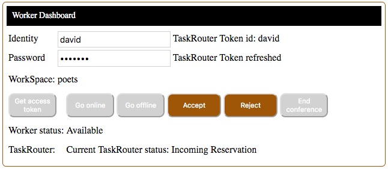

# Implement a Call Work Flow System

With Twilio Studio and TaskRouter, in less than two hours, you can set up a call flow, which is the bases of a call center. 

#### Call Work Flow


This exercise will walk you through the steps to configure your Twilio phone number to receive calls and put the callers into a queue.
The callers will listen to music while TaskRouter arranges an agent to take their call.

1. [Configure](README.md#configure-your-taskrouter-workspace) your Twilio TaskRouter Workspace.
2. [Create](README.md#create-an-ivr-studio-flow-to-manage-incoming-calls) an IVR, using Studio, to welcome the caller and put them into the TaskRouter queue.
3. [Configure](README.md#configure-your-twilio-phone-number-to-use-the-studio-flow) your Twilio phone number to use the Studio IVR.
4. [Deploy](README.md#deploy-the-taskrouter-worker-application) the TaskRouter Worker application and set the environment variables.
5. [Test](README.md#test-the-call-work-flow-system) the call work flow system.

Click [here](https://www.youtube.com/watch?v=OElX06i40Mg) for a video of me walking through the steps.
Note, the application in the video is an older PHP app, however it works basically the same.

Click [here](https://www.twilio.com/docs/taskrouter/api) for a TaskRouter: REST API Reference.

#### Implementation requirements:
- You will need a [Twilio account](http://twilio.com/console). A free Trial account will work for testing.
- For testing, you will need at least 2 phone numbers; for example two mobile phone numbers: 
one to be the caller, the other phone number for the worker (agent).

The setup instructions are located at this GitHub repository URL:

https://github.com/tigerfarm/tfptaskrouter/blob/master/README.md

--------------------------------------------------------------------------------

### Configure your TaskRouter Workspace

When a caller is added into the queue, TaskRouter creates a reservation and then asks an agent if they will accept the call.
The agent has the option to Accept, and be connected with the caller; or to Reject the call.
If the call is rejected, TaskRouter will ask the next available agent.

Go to the TaskRouter dashboard:
https://www.twilio.com/console/taskrouter/dashboard 

Create a Workspace, and set:
- Name: writers.

Create a TaskQueue for callers, and set:
- TaskQueue Name to: support.
- Max Reserved Workers: 1.
- Queue expression: skills HAS "support". Workers with the skill to handle support calls ("skills":["support"]) will be ask to take calls in this queue.

Create a Workflow, and set:
- Friendly Name: support.
- Assignment Callback, Task Reservation Timeout: 10. This gives the worker 10 seconds to accept the reservation before TaskRouter sets them to unavailable, and asks another worker to accept the call reservation.
- Default queue: support. Note, I had to shrink the screen print to be able to see "support" as an option.

Create a Worker, and set:
- Name: charles.
- Attributes to: {"skills":["support"],"contact_uri":"+16505551111"}. Replace 16505551111, with your mobile phone number. This is the number that TaskRouter will use to call the worker.

View Your TaskRouter Activities: Offline, Available, and Unavailable

### Create an IVR Using Studio

The Studio flow will welcome the call and then put them incoming into the TaskRouter support queue.

Go to the TaskRouter dashboard:
https://www.twilio.com/console/studio

Create a new flow, and set:
- Friendly name: Writers IVR.
- Use the default: Start from scratch.

Drag a "Gather Input On Call" widget onto the flow panel. This widget will welcome callers.
- Join Trigger Incoming Call to the Gather widget.
- Set the Text to Say to: "Welcome to Support. I will put you on hold while I find you an agent."
- Set "Stop gathering after" to 1 digit.

Drag an "Enqueue Call" widget onto the flow panel. This widget will put callers into the TaskRouter support queue.
- Join the Gather widget to the Enqueue Call widget.
- Set, TaskRouter Workspace, to: writers.
- Set, TaskRouter Workflow, to: support.


Click Save. Click Publish. The Studio is complete and ready to use.

--- Or, if you are creating the Studio flow with your phone (drag and drop may not work), use the New Flow option: Import from JSON.
Copy and paste the following JSON, as your New Flow JSON Flow definition text.
````
{
  "description": "A New Flow",
  "states": [
    {
      "type": "InitialState",
      "name": "Trigger",
      "properties": {
        "offset": {
          "x": 0,
          "y": 0
        },
        "flow_url": "https://webhooks.twilio.com/v1/Accounts/ACxxxxxxxxxxxxxxxxxxxxxxxxxxxxxxxx/Flows/FWxxxxxxxxxxxxxxxxxxxxxxxxxxxxxxxx"
      },
      "transitions": [
        {
          "event": "incomingMessage",
          "conditions": [],
          "next": null,
          "uuid": "0ec90fc9-0b8e-4dbc-b14f-988146b3f22b"
        },
        {
          "event": "incomingCall",
          "conditions": [],
          "next": "FFed2061cbcccea5d1e81bc370443c86af",
          "uuid": "fc31453e-5e84-4aa2-a3db-ddf78d6a2995"
        },
        {
          "event": "incomingRequest",
          "conditions": [],
          "next": null,
          "uuid": "ee80989e-62de-486a-91df-1633532be716"
        }
      ],
      "sid": "FF855b9620cafaf5495d85b14458ea7f87"
    },
    {
      "type": "Gather",
      "name": "gather_1",
      "properties": {
        "offset": {
          "x": 0,
          "y": 190
        },
        "timeout": 5,
        "finish_on_key": "#",
        "stop_gather": true,
        "number_of_digits": 1,
        "save_response_as": null,
        "say": "Welcome to Support. I will put you on hold while I find you an agent.",
        "play": null,
        "voice": "alice",
        "language": "en",
        "loop": 1,
        "hints": null,
        "gather_language": "en"
      },
      "transitions": [
        {
          "event": "keypress",
          "conditions": [],
          "next": "FFe0bce614d5fbf9de2ab854b1ee64336b",
          "uuid": "5c6ed01c-2698-46ef-b6a1-7bad7129281c"
        },
        {
          "event": "speech",
          "conditions": [],
          "next": null,
          "uuid": "e2d838f2-dd7f-4ba5-8c88-813311692a06"
        },
        {
          "event": "timeout",
          "conditions": [],
          "next": "FFe0bce614d5fbf9de2ab854b1ee64336b",
          "uuid": "27c7cac7-7daf-488c-8b2b-194661878120"
        }
      ],
      "sid": "FFed2061cbcccea5d1e81bc370443c86af"
    },
    {
      "type": "EnqueueCall",
      "name": "enqueue_1",
      "properties": {
        "offset": {
          "x": 20,
          "y": 410
        },
        "workflow_sid": "WW1dcfb9e1569ae293adfac3b5289e7d49",
        "queue_name": null,
        "priority": null,
        "timeout": null,
        "task_attributes": null,
        "wait_url": null,
        "wait_url_method": null
      },
      "transitions": [
        {
          "event": "callComplete",
          "conditions": [],
          "next": null,
          "uuid": "9ea0ebfa-a42d-424a-bba5-1c2acbfc529f"
        },
        {
          "event": "failedToEnqueue",
          "conditions": [],
          "next": null,
          "uuid": "6f1f9e4d-fdad-41ce-a925-8a89ebed763d"
        },
        {
          "event": "callFailure",
          "conditions": [],
          "next": null,
          "uuid": "a52e5ee1-f13e-49ed-af93-6db25d8ec3ed"
        }
      ],
      "sid": "FFe0bce614d5fbf9de2ab854b1ee64336b"
    }
  ]
}
````

### Configure your Twilio phone number to use the Studio IVR.

In the Twilio Console, buy a phone number, if you don't already have one:
https://www.twilio.com/console/phone-numbers/search

In the phone number’s configuration page,
- Set Voice & Fax, A Call Comes In, to: Studio Flow / Writers IVR

Test, by using your mobile phone to call your IVR Twilio phone number.
- You will hear your Say welcome message.
- You will be put into the TaskRouter queue and hear the wait music.
- Disconnect/hangup the call. Your IVR is successfully tested.

#### Test the Application on Your Computer

Agents will use their web browser, on their computer, to manage their status: 
offline, or available to accept calls.

This application is ready to run from command line.

Add the following key value pairs:
- ACCOUNT_SID : your Twilio account SID (starts with "AC", available from Twilio Console)
- AUTH_TOKEN : your Twilio account auth token (Available from Twilio Console, click view)
- TOKEN_PASSWORD : your token password (Password is required to create tokens. The password can be any string you want to use.)
- WORKSPACE_SID : your TaskRouter workspace SID


From the TaskRouter worker's side, I go to the TaskRouter worker website application
[link](http://localhost:8000/tfptaskrouter/index.html).
````
The workspace activity options are listed in the Log messages:
...
> + ActivitySid_Offline = WA31703104b45cd069126e71c5de67a869
> + ActivitySid_Available = WA87258175ab8843ec6d75e54274eb456c
> + ActivitySid_Unavailable = WAd869170e0a0d27f9846c070b0edcaf79

I enter my identity: dave, and the application password, and click Get access token.
Logs:
> Refresh the TaskRouter token using client id: dave
> TaskRouter Worker token refreshed, stringlength :3088:
> registerTaskRouterCallbacks().
> TaskRouter token refreshed.
> Worker registered: dave.
> Skills: support
> Current activity is: Offline

I click Go online.

I check worker status and see that I'm (dave) is Available(online).
$ node workerStatus.js
+++ Start.
++ List worker activity status.
+ WK1ab6ad88a07a856306c88ccaab3aa56a : edith : Offline
+ WKb9302b30213ee6a76c10cf8b4cf94612 : dave : Available
````

From the voice caller's side:
````
I make a voice call to my TaskRouter Twilio phone number.
The call is answered by the Studio flow IVR:
The Studio IVR messages is said (Say widget) and I'm put on hold in a TaskRouter workflow queue.
$ node tasksList.js
+++ List tasks and their reservations(if any).
++ SID: WT785ef314ded948051e735753ced049bc assignmentStatus: pending, Queue:support
At this time, there are no reservations.
$ node tasksReservationsList.js
+++ List tasks and their reservations(if any).
++ SID: WTa3ee1296c9f4bf072a9ed615371d5200 assignmentStatus: pending, Queue:support
````

Interactions:
````
Since the TaskRouter agent, "dave", is offered the option to Accept or Reject the task.
The workflow has a Task Reservation Timeout of 10 seconds. 
Dave does not click one of the option with 10 seconds, the reservation times out:
> reservation.created: You are reserved to handle a call from: +16505551111
> Reservation SID: WRc3d7d5e3ef968eda3038b67db775f0c5
> reservation.task.sid: WTa3ee1296c9f4bf072a9ed615371d5200
> Worker activity updated to: Offline
> taskSid = WTa3ee1296c9f4bf072a9ed615371d5200
> Reservation timed out: WRc3d7d5e3ef968eda3038b67db775f0c5
Dave is set to offline.

Dave goes back online, reservation is set to status: pending.
$ node tasksReservationsList.js
+++ List tasks and their reservations(if any).
++ SID: WTa3ee1296c9f4bf072a9ed615371d5200 assignmentStatus: reserved, Queue:support
++ SID: WTa3ee1296c9f4bf072a9ed615371d5200 assignmentStatus: reserved Task Queue:support Reservation sid:WRc3d7d5e3ef968eda3038b67db775f0c5 status:timeout workerName:dave
++ SID: WTa3ee1296c9f4bf072a9ed615371d5200 assignmentStatus: reserved Task Queue:support Reservation sid:WR1f2471e9da9af75b45cb6d67e353f029 status:pending workerName:dave

Dave goes back online and clicks Accept,
+ reservation is set to status: accepted.
$ node tasksReservationsList.js
+++ List tasks and their reservations(if any).
++ SID: WTa3ee1296c9f4bf072a9ed615371d5200 assignmentStatus: assigned, Queue:support
...
++ SID: WTa3ee1296c9f4bf072a9ed615371d5200 assignmentStatus: assigned Task Queue:support Reservation sid:WRf1b1bf3c9bc5fc6c26d36509f913f791 status:accepted workerName:dave

+ Dave is connected to the caller. Log message:
> Conference SID: CFa000943a3a04bbe352f6dffe8d8921e1
The conference call has the status: in-progress.
$ node conferenceList.js
+++ List conference calls.
+  SID: CFa000943a3a04bbe352f6dffe8d8921e1 status: in-progress friendlyName: WTa3ee1296c9f4bf072a9ed615371d5200

The reservation list program lists:
+ The task information and which agent is handling the task.
+ The task attributes list the task's converference call information.
$ node tasksReservationsList.js 
+++ List tasks and their reservations(if any).
++ SID: WTa3ee1296c9f4bf072a9ed615371d5200 assignmentStatus: assigned, Queue:support
+++ theAttributes from:+16505551111 conference.sid:CFa000943a3a04bbe352f6dffe8d8921e1 worker:CA40d37044249a5270707eb96bf9f4a1df customer:CA22a129993f8efb9403b90df060b28e1a
...
++ SID: WTa3ee1296c9f4bf072a9ed615371d5200 assignmentStatus: assigned Task Queue:support Reservation sid:WRf1b1bf3c9bc5fc6c26d36509f913f791 status:accepted workerName:dave

The worker application log message:
> Worker activity updated to: Unavailable
$ node workerStatus.js
+++ Start.
++ List worker activity status.
+ WKb9302b30213ee6a76c10cf8b4cf94612 : dave : Unavailable

The caller hangs up. The conference is still active, and other statuses are the same.
In the worker application, dave clicks End conference.
The conference is ended (set to status completed).
Worker(dave) activity updated to: Offline.
````

--------------------------------------------------------------------------------

In your browser, go to your TaskRouter Workers Application.
- WorkSpace name is displayed: writers.
- Enter your worker name: charles.
- Enter your token password.
- Click Get access token. Worker status is displayed: Offline.
- Click Go online. Worker status is displayed: Available.
- Click Go offline, and Go online, which is how you set your availability status.
- Click Go online,to be available for a call reservation.


### Test the Call Work Flow System

Call your IVR Twilio phone number, and you will be put into the TaskRouter queue.
- In your TaskRouter Workers Application, Accept and Reject options are highlighted.


- Click Accept. When you accept a call, TaskRouter will dial your TaskRouter worker phone number("contact_uri").
- Your phone will ring, and, End conference will be highlighted because the call is a conference call.
- Answer your phone, and you are connected to the caller.
- Click End conference, and both you (the TaskRouter worker) and the caller are disconnected from the conference; the conference is ended.

You now have a working and tested TaskRouter implementation.

#### Next steps:
- Add more workers.
- Add a sales TaskRouter queue (skills HAS "sales") and Workflow.
- Add sales workers ({"skills":["sales"],"contact_uri":"+16505552222"}).
- Add sales as an IVR option in the Studio flow. This will require adding a Split widget and another Enqueue Call widget. Click [here](https://www.twilio.com/docs/studio#get-started-with-twilio-studio) for a sample flow with a Split widget.
- Handle the case where no workers are available and the Workflow times out. Create and test a [Studio voicemail](https://www.twilio.com/docs/studio/widget-library#record-voicemail) flow. Link it into your Workflow timeout option.
- Add business hours to your IVR. If a caller calls outside of the [business hours](https://www.twilio.com/blog/2018/06/custom-javascript-twilio-functions-code-studio-flows.html), put them straight into voicemail.
- Implement a Twilio Client so that agents can receive calls on their laptop. Click [here](https://github.com/tigerfarm/OwlClient) for my sample Twilio Client which has more features such as putting callers on hold.

--------------------------------------------------------------------------------

## TaskRouter Worker Application Version 3.2

This application is used by Twilio TaskRouter workers to 
manage their availability status, accept or reject reservation calls,
and end their reservation conference calls.

## Functionality

- Using their browser, the application allows workers to enter their identity and a password.
- Workers manage their status: available to take a call, busy while on a call, or unavailable.
- Status is displayed in the browser.
- Workers can accept or reject a call reservation.
- If a worker's reservation times out, the worker status is changed to unavailable.
- A worker can end a call which disconnects all participants from the reservation conference call.
- If a task is set to wrapping, it is automatically reset to completed. This avoids a worker not being able to reset their status.

Worker application screen print:


--------------------------------------------------------------------------------

## Documentation for Developers

### Local host Implementation using the included NodeJS HTTP Webserver

Notes, the Twilio Node.JS helper library is not required.
The server side can run locally on a computer using NodeJS, or run on a website that runs PHP programs.

Download the project zip file.

https://github.com/tigerfarm/tigtaskrouterworker

1. Click Clone or Download. Click Download ZIP.
2. Unzip the file into a work directory.
3. Change into the unzipped directory.

Install the NodeJS "request" module:
````
    $ npm install request
````
Run the NodeJS HTTP server.
````
    $ node nodeHttpServer.js
    +++ Start: nodeHttpServer.js
    Static file server running at
      => http://localhost:8000/
    CTRL + C to shutdown
    ...
````
Use a browser to access the application:

http://localhost:8000/index.html
    
#### Server side Application Programs

The programs are called from the browser application using Ajax.

getTrActivites.php : When initializing the browser side client, get the WorkSpace friendly name and the TaskRouter activities.

generateTrToken.php?tokenPassword= + tokenPassword + &clientid= + clientId : given a client identity and the password, generate a token.

conferenceEndFn.php?conferenceName= + theConference : given a conference SID, end the conference.

taskReservationTaskFix.php?taskSid= + taskSid : given a task SID, if the status is wrapping, change it to completed.

#### Utility Programs

conferenceListInProgress.php : List conferences that are in progress.

taskDeleteAll.php : remove all tasks.

taskReservationList.php : List task information.

taskReservationListFix.php : List task information and, if the status is wrapping, change it to completed.

workerStatus.js : Node.js program to list the status of all the WorkSpace workers.

nodeHttpServer.js : Node.js web server program for testing this application on a local host.

--------------------------------------------------------------------------------

Cheers...